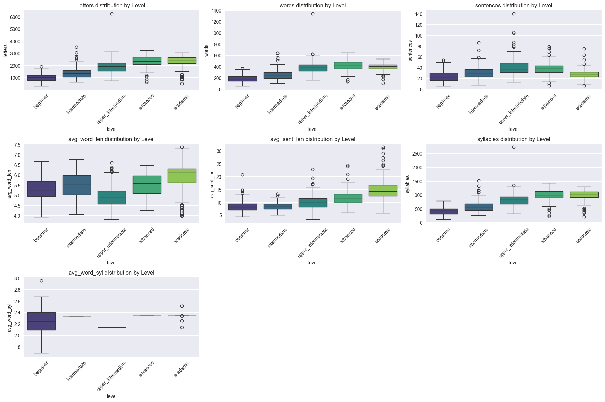
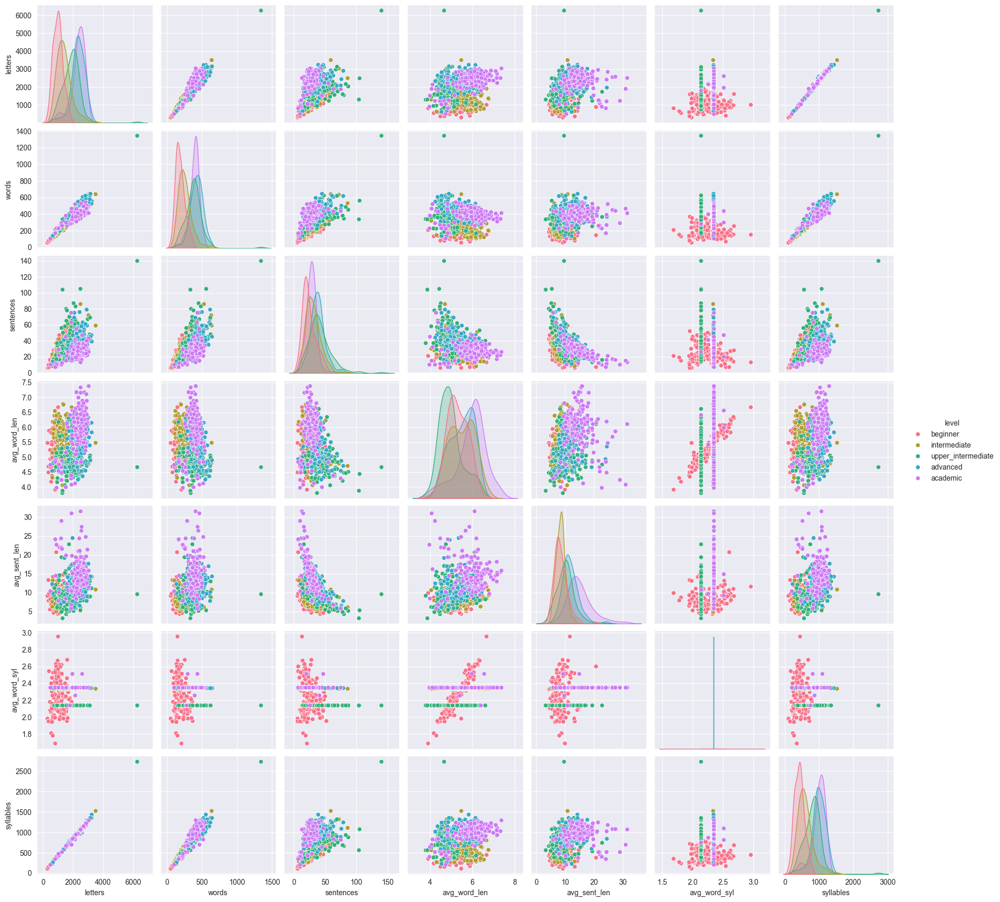
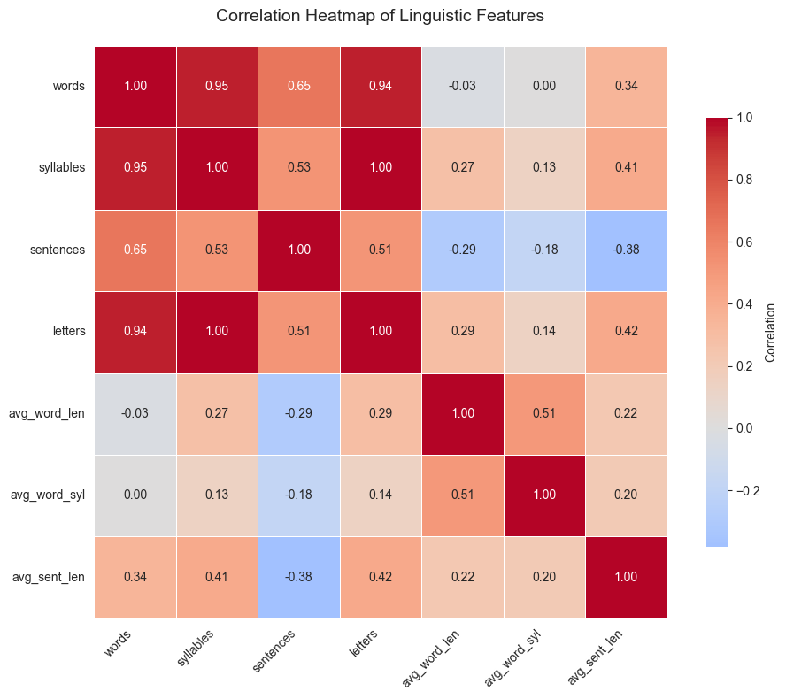
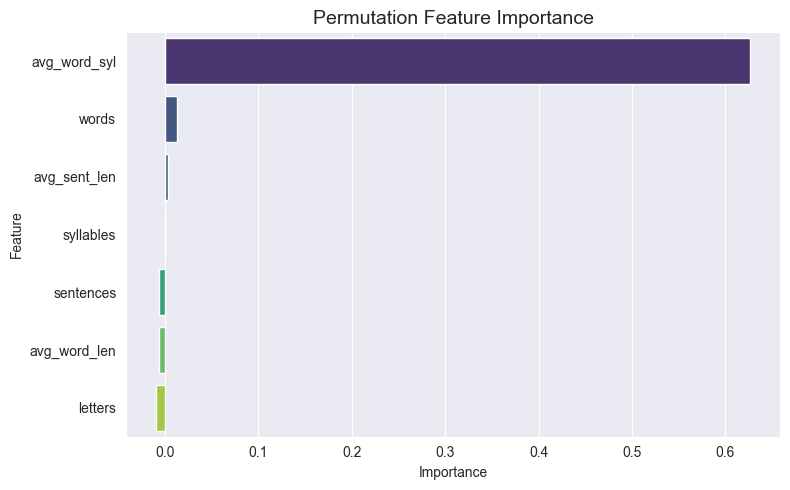
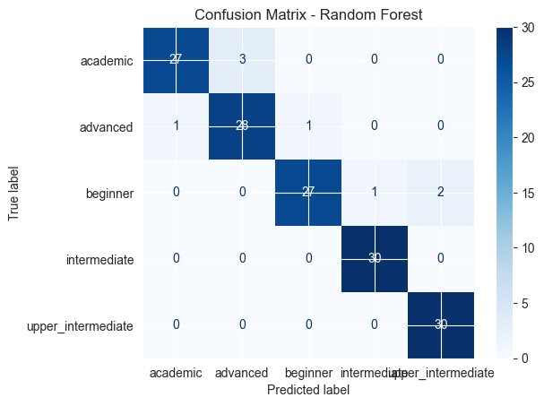

# ukrainian_readability project

## 💡 Description of the Problem

Although readability formulas such as *Flesch Reading Ease* and *Flesch-Kincaid Grade Level* exist for English and some other languages, Ukrainian currently lacks any established computational model to automatically assess text difficulty.
This creates challenges for Ukrainian language learners, teachers, and educational material developers, who have no objective way to evaluate whether a text is appropriate for a given proficiency level.

To address this gap, I used the Ukrainian Textbook Readability Dataset created by Serge Prykhodchenko et al., which contains linguistic statistics extracted from Ukrainian school textbooks (Grades 1–9).
The original researchers focused on comparing various readability formulas, but their raw dataset also provides detailed structural features (word counts, sentence lengths, syllable counts, etc.).

In this project, I:

* Focused only on the raw linguistic features rather than the Flesch-style readability indices.
* Reorganized the data into five aggregated difficulty levels (Beginner → Academic).
* Performed feature analysis and model training using Random Forest and XGBoost classifiers.
* Achieved 95% accuracy in predicting the difficulty level of a given text passage.

This model can later be used to estimate the difficulty of Ukrainian texts for language learners, helping educators and developers automatically classify materials by reading level.


## 📚 Data Source

The dataset used in this project is based on the Ukrainian Textbook Readability Dataset by
[Serge Prykhodchenko](https://github.com/prykhodchenkosd/ukrtb).  
The original dataset includes linguistic statistics extracted from Ukrainian school textbooks
(Grades 1–9). It was used here under an open-source academic license for educational purposes.

All preprocessing, labeling, and level assignments (elementary → academic) were performed by me.


## 🧹 Data Preparation and Cleaning


* Combined and cleaned datasets from Grades 1–9
* Added difficulty level labels: Beginner → Academic
* Handled missing values using mean imputation
* Reduced duplicates appeared due to excel file
* Saved cleaned dataset as combined_clean.csv


## 📈 Exploratory Data Analysis (EDA)


### Feature Distribution Overview

To explore the general structure of the dataset, I visualized the distribution of each numeric feature across five difficulty levels.
Most variables showed clear progressive patterns from Beginner to Academic, confirming that the dataset captures linguistic development across grades.

In particular:

* Average word length and average sentence length steadily increased with level.
* Total words and letters varied mainly with text length, not difficulty.
* Average syllables per word again showed the clearest separation between levels, foreshadowing its importance in the final model.

These visualizations supported the hypothesis that structural linguistic features alone can reliably distinguish text complexity.



*(Full EDA, including all 7 distribution plots, is available in the Jupyter notebook.)*


### Pairplot Analysis

During Exploratory Data Analysis (EDA), I used a pairplot (7×7 matrix) to visually examine relationships between all numeric features.
This helped verify that the data contained clear separations between reading levels and revealed how certain features interact.

In particular:

* Longer sentences and words (both in letters and syllables) correlated strongly with higher difficulty levels.
* Beginner and Intermediate levels clustered closely, while Academic-level texts formed a visibly distinct region.
* Several features were highly correlated, suggesting redundancy, which was later confirmed by the feature importance analysis.

While the pairplot contained many combinations, it provided a global overview of data structure and helped justify which features to keep for model training.



## 🌡️ Correlation Heatmap Description

To identify relationships between features, I plotted a correlation heatmap of all numeric variables.
The analysis revealed strong positive correlations between features such as Words, Letters, and Sentences, which all reflect text length.
At the same time, avg_word_syl and avg_word in Letters showed weaker correlations with other variables, indicating they capture distinct linguistic properties.

This confirmed that word-level features contribute unique information about text complexity, justifying their inclusion in the final model.




## 🤖 Model Training and Results
After data cleaning, feature selection, and hyperparameter tuning, two models were trained and compared — Random Forest and XGBoost.
Both achieved strong and consistent performance, with Random Forest slightly outperforming XGBoost on the validation set.

Model Results

* Accuracy: 0.947
* Macro F1-score: 0.95
* Per-class F1-scores:

  * Beginner: 0.93
  * Academic: 0.93
  * Advanced: 0.92
  * Intermediate: 0.98
  * Upper Intermediate: 0.97

Best hyperparameters:

```
  {'max_depth': 10, 'min_samples_split': 2, 'n_estimators': 200}
```

The model achieves high performance across all proficiency levels, with the macro F1-score showing balanced accuracy between classes.

These results indicate that the model successfully distinguishes between different difficulty levels based on a small set of structural linguistic features.
Given that the dataset represents real Ukrainian school materials (Grades 1–9), this level of accuracy demonstrates that the features capture genuine linguistic progression between beginner and advanced levels.


## 🧩 Feature Importance Analysis


To understand which linguistic characteristics most strongly determine text difficulty, I analyzed the trained model using permutation feature importance.
The following features were included in the final model:

* words – total number of words in the text
* sentences – total number of sentences
* letters – total number of letters
* avg_word_len – average word length in letters
* avg_word_syl – average word length in syllables
* avg_sent_len – average sentence length in words

The analysis revealed that the **average number of syllables per word (avg_word_syl)** had by far the strongest predictive power (importance ≈ 0.8), while all other features contributed only marginally (0.01–0.03).

### Interpretation

This result aligns closely with established readability theory.
In many languages—including Ukrainian—words with more syllables tend to be morphologically complex and less frequent in everyday language.
Texts containing a higher proportion of such multisyllabic words are therefore typically more challenging for learners to process.

Interestingly, the total counts of words or letters weren't strong indicators of difficulty.
This suggests that text *length* alone is not what drives complexity; instelexical and morphological richnessss (captured by syllable structure) plays the central role.

### Visual Summary

Feature importance was visualized using permutation plots and bar charts.
The clear dominance of AvgWord in Syl supports the conclusion that syllabic complexity is the main determinant of Ukrainian text readability in this dataset.





## 🧮 Confusion Matrix and Evaluation
Model performance was further examined using a confusion matrix, which showed balanced predictions across all five levels: Beginner, Intermediate, Upper Intermediate, Advanced, and Academic.

The matrix revealed that most misclassifications occurred between neighboring levels (e.g., Intermediate vs. Upper Intermediate), which is expected given their linguistic similarity.
The model rarely confused distant levels such as Beginner and Academic, confirming that it captures the overall progression of linguistic complexity effectively.




## 🧰 Project Structure


```

midterm_project/
│
├── data/
│   ├── res2_1-5.xlsx
│   ├── cleaned_data.csv
│   └── data_source.txt
│
├── EDA/
│   └── readability_EDA.ipynb
│
├── model/
│   └── ukrainian_readability_model.pkl
│
├── app/
│   ├── train.py
│   ├── predict.py
│
├── images/
│   ├── feature_distributions.png
│   ├── pairs4.png
│   ├── correlationheatmap.png
│   ├── featureimportance.png
│   ├── confusion.png
|   .......
│──Dockerfile
│── requirements.txt
└── README.md

```


## 🐳 Docker Usage

## Docker Usage

Pull the image from Docker Hub:
```
docker pull nathaira/ukrainian-readability
```

Run the container interactively:
```
docker run -it nathaira/ukrainian-readability
```

Optional: run the training script inside the container:
```
docker run -it nathaira/ukrainian-readability python app/train.py
```


## 🚀 Deployment

* Optional: URL or note that the service runs locally via Docker (127.0.0.1:8000)
* The project is also deployed on Render:

[Ukrainian Readability](https://ukrainian-readability.onrender.com)

You can send requests to the API or view results directly in the browser.


## 🙏 Acknowledgments

Dataset by [Serge Prykhodchenko](https://github.com/prykhodchenkosd/ukrtb)

ML Zoomcamp by Alexey Grigorev

Special thanks for open educational resources and Ukrainian NLP community inspiration.


